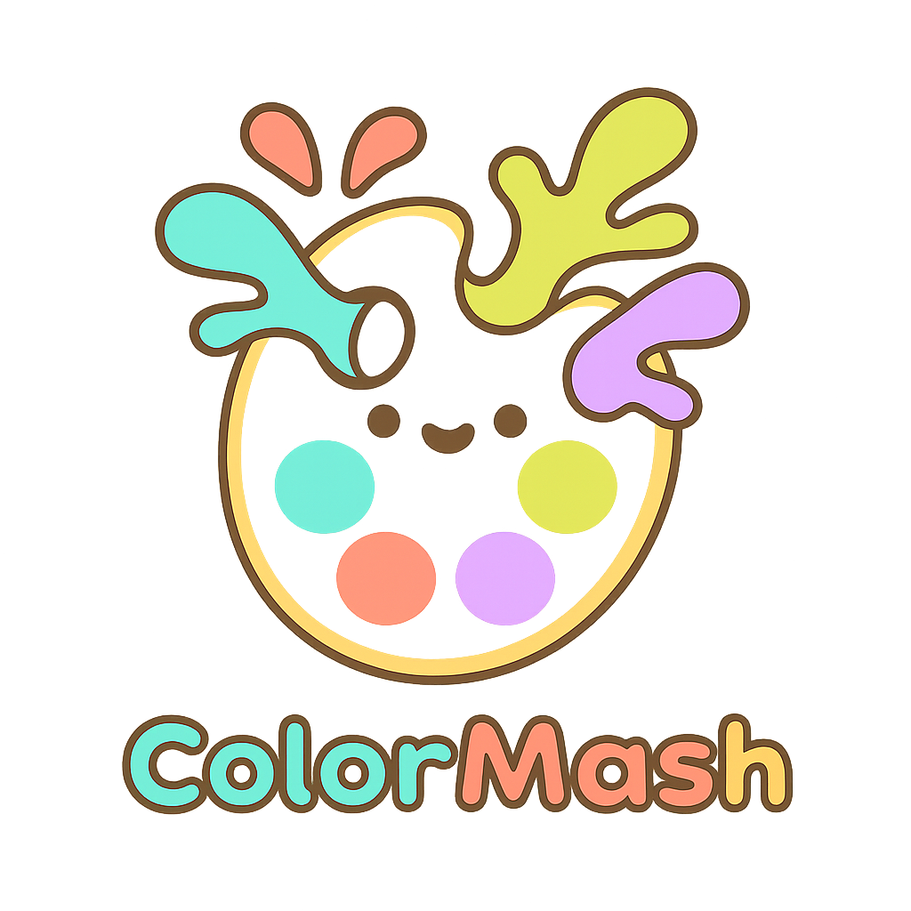

<div align="center">

# 🎨 ColorMash 🎨
</div>

<div align="center">
  
  
  **The Ultimate Color Matching Challenge**
  
  Test your color perception skills in this addictive daily color matching game!
  
  [](https://react.dev/)
  [](https://developers.reddit.com/)
  [](https://www.typescriptlang.org/)
</div>

## 🎯 What is ColorMash?

ColorMash is a daily color matching game where players try to recreate a target color using an intuitive color picker. Each day brings a new challenge, and players can share their accuracy scores with friends!

### ✨ Features

- 🎨 **Daily Color Challenges** - New target color every day
- 🎯 **Precision Scoring** - Advanced Delta E color difference algorithm
- 📱 **Mobile Friendly** - Responsive design for all devices
- 🎵 **Immersive Audio** - Background music and sound effects
- 🏆 **Social Sharing** - Share your scores on X/Twitter and Reddit
- 🎮 **Intuitive Controls** - Easy-to-use color picker interface

## 🚀 How to Play

1. **Look at the target color** displayed on the left
2. **Use the color picker** to match it as closely as possible
3. **Submit your guess** and see your accuracy percentage
4. **Share your score** and challenge your friends!

## 🛠️ Tech Stack

- **[React](https://react.dev/)** - Modern UI framework
- **[TypeScript](https://www.typescriptlang.org/)** - Type-safe development
- **[Vite](https://vite.dev/)** - Lightning-fast build tool
- **[Tailwind CSS](https://tailwindcss.com/)** - Utility-first styling
- **[Express](https://expressjs.com/)** - Backend API server
- **[Devvit](https://developers.reddit.com/)** - Reddit's developer platform

## 🎮 Game Mechanics

### Color Matching Algorithm
ColorMash uses the **Delta E 76** color difference formula to calculate accuracy:
- Converts colors to LAB color space for perceptual accuracy
- Calculates the Euclidean distance between target and user colors
- Provides percentage-based scoring (0-100%)

### Scoring System
- **95-100%**: 🔥 Perfect Match!
- **85-94%**: 🌟 Amazing!
- **70-84%**: 👏 Great Job!
- **50-69%**: 👍 Good Try!
- **0-49%**: 🎯 Not Bad!

## 🚀 Getting Started

### Prerequisites
- Node.js 22 or higher
- Reddit Developer Account

### Installation

1. **Clone the repository**
   ```bash
   git clone https://www.github.com/ombhojane/colormashh.git
   cd colormashh
   ```

2. **Install dependencies**
   ```bash
   npm install
   ```

3. **Start development server**
   ```bash
   npm run dev
   ```

## 📋 Available Commands

| Command | Description |
|---------|-------------|
| `npm run dev` | Start development server with live reload |
| `npm run build` | Build production version |
| `npm run deploy` | Deploy to Reddit |
| `npm run launch` | Publish for review |
| `npm run login` | Authenticate with Reddit |
| `npm run check` | Run type checking and linting |

## 🎨 Game Assets

The game includes custom-designed assets:
- 🎵 Background music (`BGAudio.mp3`)
- 🔊 Sound effects (`Submit.wav`)
- 🏠 Navigation icons (`Home.png`, `Reset.png`)
- ℹ️ UI elements (`Info.png`, `Audio.png`)
- 🖼️ Branding (`Logo.png`, `ThumbnailYT.png`)

## 🤝 Contributing

We welcome contributions! Here's how you can help:

1. **Fork the repository**
2. **Create a feature branch** (`git checkout -b feature/amazing-feature`)
3. **Commit your changes** (`git commit -m 'Add amazing feature'`)
4. **Push to the branch** (`git push origin feature/amazing-feature`)
5. **Open a Pull Request**

## 📱 Social Features

- **Share on X/Twitter**: Direct integration with Twitter's sharing API
- **Post to Reddit**: Native Reddit sharing for community engagement
- **Challenge Friends**: Shareable score messages with engaging copy

## 🎯 Future Enhancements

- [ ] Leaderboards and rankings
- [ ] Color theory educational content
- [ ] Multiple difficulty levels
- [ ] Achievement system
- [ ] Color blindness accessibility options
- [ ] Weekly challenges and tournaments

## 📄 License

This project is licensed under the MIT License - see the [LICENSE](LICENSE) file for details.

## 🙏 Acknowledgments

- Built with ❤️ using Reddit's Devvit platform
- Color science powered by Delta E algorithms
- UI/UX inspired by modern color theory

---

<div align="center">
  <strong>Ready to test your color skills? Play ColorMash today!</strong>
  
  [🎮 Play Now]() | [🐛 Report Bug](your-issues-url) | [💡 Request Feature](your-issues-url)
</div>
